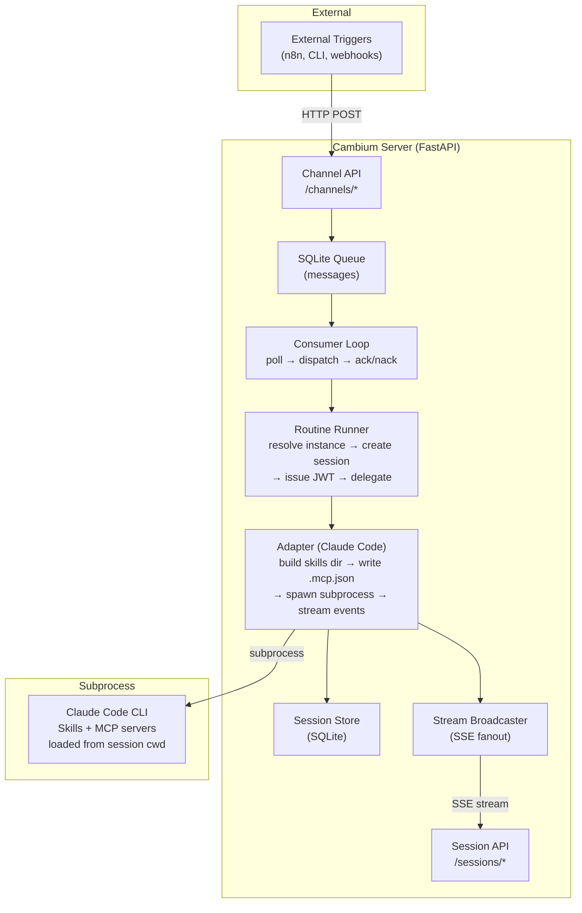
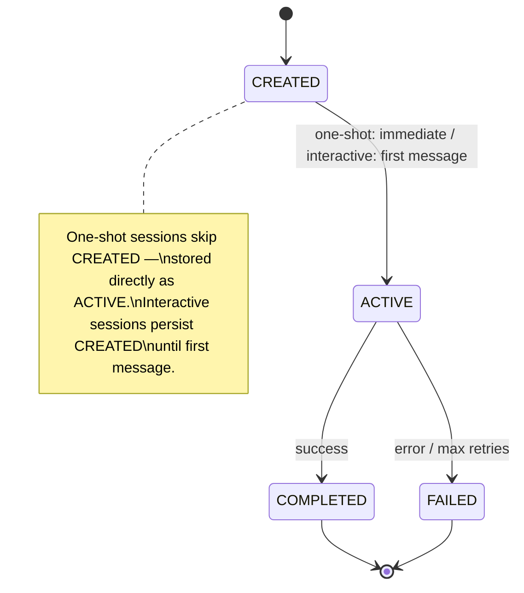
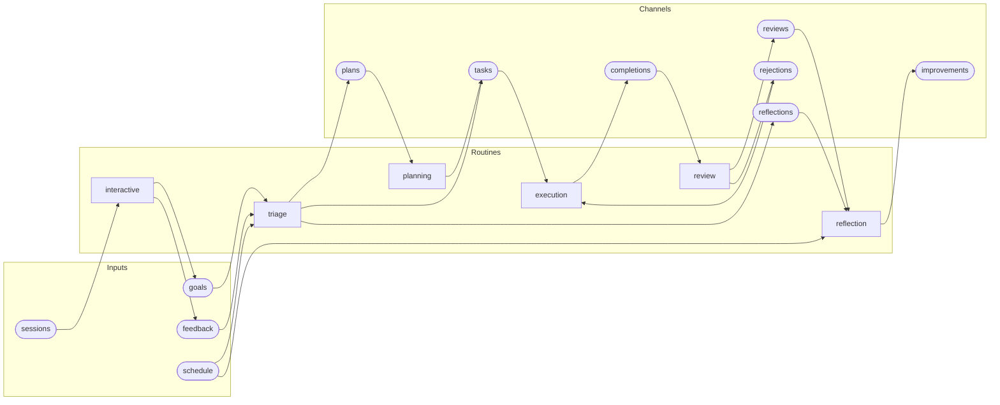
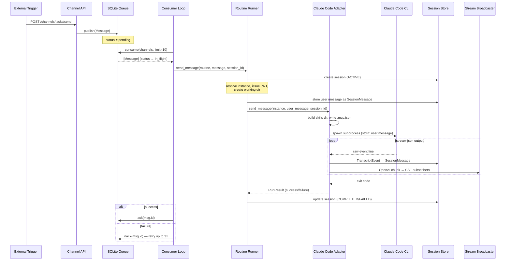
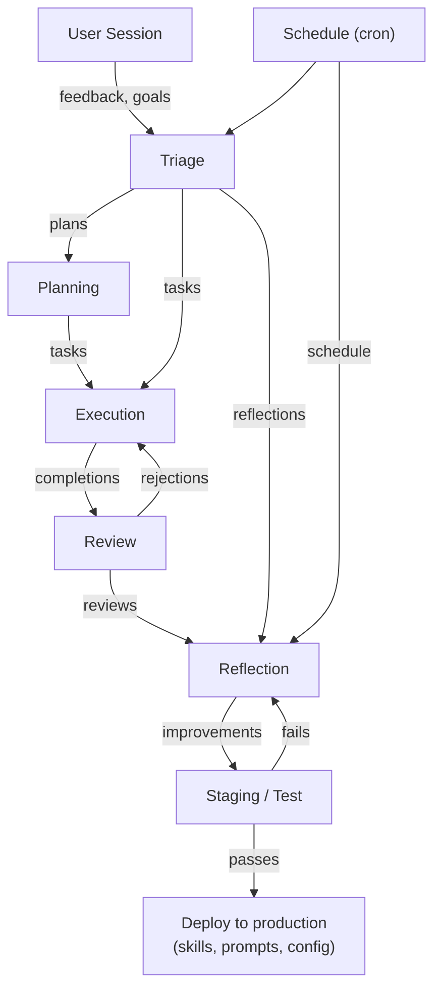

# Cambium Architecture

> Living document. Last updated: 2026-04-05.
> This file is the canonical reference for how the system fits together.
> Update it when the architecture changes.

## What Cambium Is

A personal empowerment engine — an async AI agent framework oriented around a single user's values. Not a task management system powered by AI, but a thought partner that learns, reflects, and improves.

The core differentiator is the **self-improvement loop**: skills are hypotheses about how to help the user; the lifecycle engine runs experiments, measures outcomes against the user's constitution, and proposes improvements.

## System Overview



## Core Abstractions

### Message

The fundamental unit of communication. Travels through named **channels**.

```
Message
├── id: str               # Generated from uuid4()
├── channel: str          # e.g., "tasks", "completions"
├── payload: dict         # Arbitrary JSON data
├── source: str           # Who published it
├── status: pending → in_flight → done | failed
├── attempts: int         # Retry count (max 3)
├── timestamp: datetime
└── claimed_at: datetime | None
```

### Routine

YAML-defined event handler. Binds a channel listener to an adapter instance. Routines define **permissions** — what a routine can read and write.

```yaml
# Example: execution.yaml
name: execution
adapter_instance: execution      # Which adapter config to use
listen: [tasks, rejections]      # Channels to consume from
publish: [completions]           # Channels allowed to emit to
```

### Adapter Instance

User-configured personality of an adapter type. Each instance has its own model, system prompt, skills, and MCP servers.

```yaml
# Example: ~/.cambium/adapters/claude-code/instances/execution.yaml
name: execution
adapter_type: claude-code
config:
  model: opus
  system_prompt_path: adapters/claude-code/prompts/execution.md
  skills: [cambium-api]
  mcp_servers: [clickup, gmail]
```

### Adapter Type

Runtime abstraction — how to execute an adapter instance. Currently one implementation: `ClaudeCodeAdapter`.

```
AdapterType (ABC)
├── send_message(instance, user_message, session_id, session_token,
│                api_base_url, live, on_event, on_raw_event, cwd) → RunResult
│   Callbacks:
│   ├── on_event(chunk)        # OpenAI-format SSE chunks → broadcaster
│   └── on_raw_event(event)    # TranscriptEvent → session store
└── launch_interactive(instance, session_id, cwd)  # exec into CLI
```

### Session

Tracks a single execution context. Two types:

| Type | Created by | Lifecycle |
|------|-----------|-----------|
| ONE_SHOT | Consumer loop | Message arrives → session created (ACTIVE) → adapter runs → COMPLETED/FAILED |
| INTERACTIVE | Session API | Client creates → sends messages → observes via SSE → closes |



```
Session
├── id: str               # Generated from uuid4()
├── type: ONE_SHOT | INTERACTIVE
├── status: CREATED → ACTIVE → COMPLETED | FAILED
├── routine_name, adapter_instance_name
├── metadata: dict        # Arbitrary session metadata
└── created_at, updated_at: datetime
```

Note: `working_dir` (`~/.cambium/data/sessions/{id}/`) is computed at runtime by the RoutineRunner, not stored on the Session model. Messages are stored separately in the `session_messages` table via `SessionStore`.

### Skill

Claude Code native capability — a directory containing `SKILL.md` with YAML frontmatter.

Skills are the agent's tools. The built-in `cambium-api` skill lets the agent publish messages to channels using `CAMBIUM_API_URL` and `CAMBIUM_TOKEN` environment variables. This is how adapters trigger downstream work **without knowing about Cambium internals**.

### TranscriptEvent

Adapter-agnostic event for persistence. Each adapter translates its native stream format into this contract; the runner persists it blindly.

```
TranscriptEvent
├── role: assistant | user | system | tool
├── content: str              # Human-readable summary
├── event_type: str           # Adapter-specific label
└── raw: dict                 # Original event (nothing lost)
```

## Channel Topology

This is the pub/sub wiring between routines — the "nervous system" of the agent.



### Channel Reference

| Channel | Producers | Consumers | Purpose |
|---------|-----------|-----------|---------|
| `sessions` | API / external | interactive | User-initiated conversations |
| `goals` | interactive | triage | User's stated goals and intentions |
| `feedback` | interactive | triage | User corrections, preferences, reactions |
| `schedule` | external (cron) | triage, reflection | Time-based triggers |
| `plans` | triage | planning | Work that needs decomposition |
| `tasks` | triage, planning | execution | Concrete work items ready to run |
| `completions` | execution | review | Finished work awaiting quality check |
| `reviews` | review | reflection | Quality assessments of completed work |
| `rejections` | review | execution | Work sent back for revision |
| `reflections` | triage | reflection | Signals to self-assess and improve |
| `improvements` | reflection | *(consumed by user/future routines)* | Proposed changes to skills, prompts, config |

## Data Flow: End to End



## Configuration Model

All user state lives in `~/.cambium/`, bootstrapped by `cambium init`.

```
~/.cambium/
├── config.yaml                     # Framework config (db path, queue adapter)
├── constitution.md                 # User's values, goals, priorities
├── mcp-servers.json                # MCP server registry (user-created, not seeded by init)
│
├── routines/                       # Channel → adapter bindings
│   ├── triage.yaml
│   ├── planning.yaml
│   ├── execution.yaml
│   ├── review.yaml
│   ├── reflection.yaml
│   └── interactive.yaml
│
├── adapters/
│   └── claude-code/
│       ├── instances/              # Adapter personalities
│       │   ├── triage.yaml
│       │   ├── execution.yaml
│       │   └── ...
│       ├── prompts/                # System prompts per instance
│       │   ├── triage.md
│       │   ├── execution.md
│       │   └── ...
│       └── skills/                 # Seeded with cambium-api; user adds custom skills here
│
├── data/
│   ├── cambium.db                  # SQLite (messages + sessions + transcripts)
│   ├── sessions/{session_id}/      # Working dir per execution
│   ├── memory/                     # User memory/context (reserved, not yet integrated)
│   └── logs/                       # Execution logs (reserved, not yet integrated)
│
├── knowledge/                      # Knowledge base (user-managed)
└── .git/                           # Version-controlled for backup
```

### MCP Server Config

```json
// ~/.cambium/mcp-servers.json
{
  "clickup": {
    "command": "python3",
    "args": ["-m", "mcp.server.clickup"],
    "env": { "CLICKUP_TOKEN": "..." }
  },
  "gmail": {
    "url": "https://gmail.mcp.claude.com/mcp",
    "headers": { "Authorization": "Bearer ..." }
  }
}
```

Supports both `stdio` (command + args) and `remote` (url + headers) transports. The adapter converts these to `.mcp.json` format and writes it to the session's working directory. Claude Code discovers it automatically from cwd.

## CLI Entry Points

| Command | Purpose |
|---------|---------|
| `cambium init [--github]` | Bootstrap `~/.cambium/` from defaults. Optionally create private GitHub repo for backup. |
| `cambium server [--live] [--port 8350]` | Start FastAPI server + consumer loop. `--live` enables real Claude Code execution (vs mock). |
| `cambium send CHANNEL [PAYLOAD]` | Publish a message to a channel via HTTP. |
| `cambium chat ROUTINE` | Start interactive Claude Code session with a routine's config. Execs into CLI. |

## API Surface

### Unauthenticated

| Endpoint | Method | Purpose |
|----------|--------|---------|
| `/channels/{channel}/send` | POST | Publish message (external triggers) |
| `/queue/status` | GET | Pending count + subscribed channels |
| `/health` | GET | Server health + consumer status |

### Authenticated (JWT — issued to adapter sessions)

| Endpoint | Method | Purpose |
|----------|--------|---------|
| `/channels/{channel}/publish` | POST | Publish with permission check (routine must list channel in `publish`) |
| `/channels/permissions` | GET | Query routine's read/write channels |

### Session API

| Endpoint | Method | Purpose |
|----------|--------|---------|
| `/sessions` | POST | Create interactive session |
| `/sessions/{id}/messages` | POST | Send message → SSE stream response |
| `/sessions/{id}/messages` | GET | Conversation history |
| `/sessions/{id}` | GET | Session metadata |
| `/sessions/{id}/stream` | GET | Observe running session (SSE) |
| `/sessions/{id}` | DELETE | End session |

## Key Design Decisions

1. **Adapters don't know about channels.** An adapter receives a message and produces output. To trigger downstream work, the agent uses the `cambium-api` skill — calling back to the server via HTTP with its JWT token. This keeps adapters decoupled from the framework.

2. **Everything in `~/.cambium/`.** User config, routines, prompts, skills, MCP servers, and data all live in one directory. The framework reads from it; `cambium init` seeds it from `defaults/`. This directory is git-backed for versioning and backup.

3. **SQLite for everything persistent.** Queue, sessions, transcripts — single DB file at `~/.cambium/data/cambium.db`. Simple, reliable, no external dependencies.

4. **TranscriptEvent as adapter-agnostic contract.** Each adapter translates its native stream format (Claude's stream-json, future adapters' formats) into TranscriptEvents. The runner persists them without inspecting content. Format-specific logic lives in the adapter, not the runner.

5. **JWT-scoped permissions.** Each session gets a token encoding its routine name. When the agent publishes to a channel via `cambium-api`, the server verifies the routine is allowed to publish there. This prevents a triage agent from accidentally writing to `completions`.

6. **One-shot vs interactive sessions.** The consumer loop handles one-shot (fire-and-forget) execution. The session API handles interactive (multi-turn, SSE-observable) conversations. Same adapter, different lifecycle.

## Current State & Gaps

### Implemented (as of 2026-04-05)
- Core server, consumer loop, queue, session store
- Claude Code adapter with skills, MCP passthrough, transcript storage
- Channel-based pub/sub with JWT permissions
- `cambium init` with GitHub backup option
- Interactive sessions via API (SSE streaming)
- 6 default routines (triage, planning, execution, review, reflection, interactive)

### In Progress
- **Phase 2: Port Marcus** — replacing n8n + async-runner.py with Cambium's consumer loop
- **ClickUp polling source** — native task ingestion (replacing n8n trigger)

### Not Yet Built
- **Self-improvement loop** (Phase 4) — reflection routine proposes changes to skills/prompts; review routine validates; staging environment tests before deploy
- **Skill testing / staging** — ephemeral environment to validate changes before promoting to production config
- **Memory / knowledge layer** — `~/.cambium/knowledge/` directory exists but no framework integration
- **Configuration hot-reload** — changes to routines/adapters/skills require server restart
- **Dead-letter queue** — messages that fail 3x are marked `failed` with no alerting or recovery path
- **Metrics / observability** — no built-in execution time, success rate, or queue depth tracking
- **Non-streaming session mode** — API returns 501 for `stream=False`

## Future: Self-Improvement Loop

The long-term vision. Not yet implemented, but the architecture is designed for it.



The reflection routine:
1. Receives reviews of completed work + scheduled self-assessment triggers
2. Attributes outcomes to specific skills, prompts, or decisions
3. Proposes concrete improvements (skill edits, prompt changes, config tweaks)
4. Publishes to `improvements` channel

The staging environment:
1. Creates ephemeral copy of current config
2. Applies proposed improvement
3. Runs automated validation (smoke tests, skill tests)
4. If passes: creates PR for human review
5. If fails: feeds failure data back to reflection
