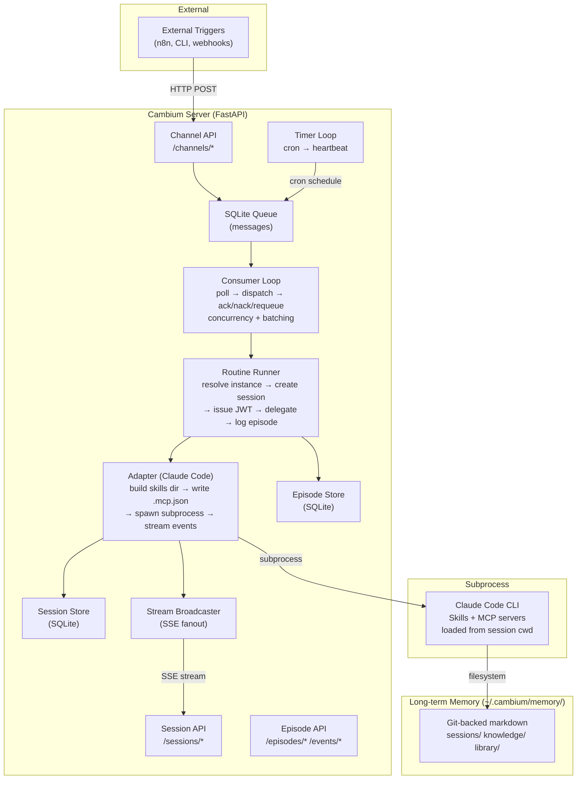
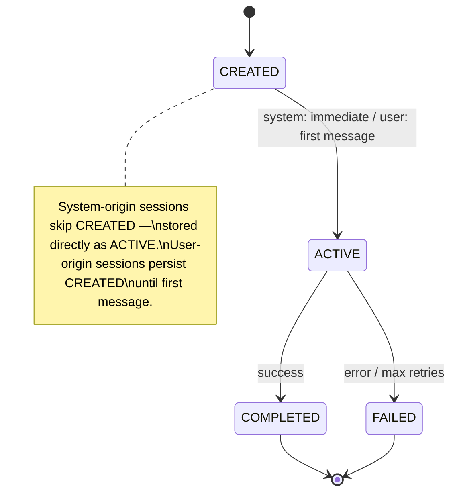
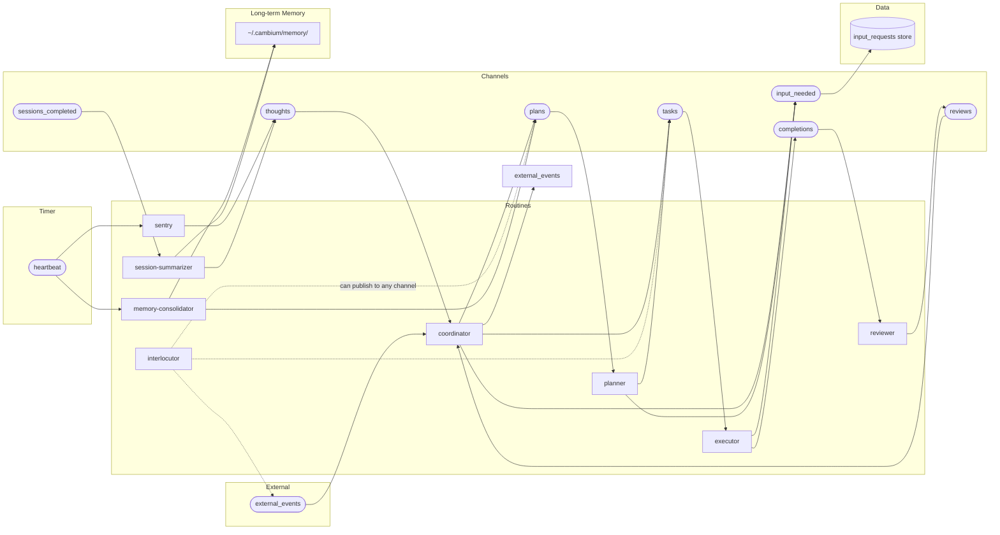
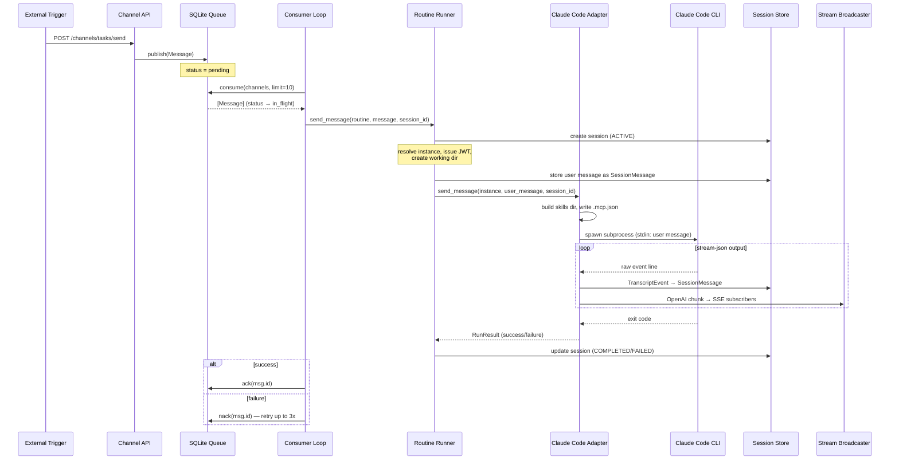
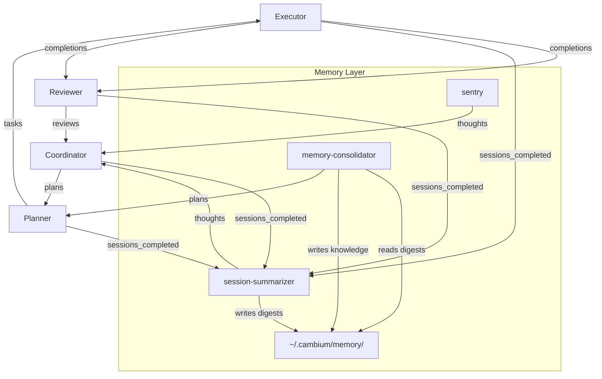

# Cambium Architecture

> Living document. Last updated: 2026-04-06.
> This file is the canonical reference for how the system fits together.
> Update it when the architecture changes.

## What Cambium Is

A personal empowerment engine — an async AI agent framework oriented around a single user's values. Not a task management system powered by AI, but a thought partner that learns, reflects, and improves.

The core differentiator is the **self-improvement loop**: skills are hypotheses about how to help the user; the lifecycle engine runs experiments, measures outcomes against the user's constitution, and proposes improvements.

## System Overview



## Core Abstractions

### Message

The fundamental unit of communication. Travels through named **channels**.

```
Message
├── id: str               # Generated from uuid4()
├── channel: str          # e.g., "tasks", "completions"
├── payload: dict         # Arbitrary JSON data
├── source: str           # Who published it
├── status: pending → in_flight → done | failed
├── attempts: int         # Retry count (max 3)
├── timestamp: datetime
└── claimed_at: datetime | None
```

### Routine

YAML-defined event handler. Binds a channel listener to an adapter instance. Routines define **permissions** — what a routine can read and write.

```yaml
# Example: executor.yaml
name: executor
adapter_instance: executor       # Which adapter config to use
listen: [tasks]                  # Channels to consume from
publish: [completions, input_needed]  # Channels allowed to emit to
max_concurrency: 4               # Max simultaneous sessions (0 = unbounded)
```

Optional fields:

| Field | Default | Purpose |
|-------|---------|---------|
| `max_concurrency` | `0` (unbounded) | Cap on simultaneous sessions for this routine |
| `suppress_completion_event` | `false` | If true, session completion does not emit `sessions_completed` |
| `batch_window` | `0.0` | Seconds to buffer incoming messages before dispatch (0 = no batching) |
| `batch_max` | `1` | Max messages per batch (1 = no batching) |

When `max_concurrency` is reached, incoming messages are **requeued** (returned to pending without incrementing retry count) rather than dropped. The `batch_window` and `batch_max` fields work together — the coordinator uses 10s / 10 to coalesce rapid-fire events into a single dispatch.

### Adapter Instance

User-configured personality of an adapter type. Each instance has its own model, system prompt, skills, and MCP servers.

```yaml
# Example: ~/.cambium/adapters/claude-code/instances/executor.yaml
name: executor
adapter_type: claude-code
config:
  model: opus
  system_prompt_path: adapters/claude-code/prompts/executor.md
  skills: [cambium-api]
  mcp_servers: [clickup, gmail]
```

### Adapter Type

Runtime abstraction — how to execute an adapter instance. Currently one implementation: `ClaudeCodeAdapter`.

```
AdapterType (ABC)
├── send_message(instance, user_message, session_id, session_token,
│                api_base_url, live, on_event, on_raw_event, cwd) → RunResult
│   Callbacks:
│   ├── on_event(chunk)        # OpenAI-format SSE chunks → broadcaster
│   └── on_raw_event(event)    # TranscriptEvent → session store
└── attach(instance, session_id, cwd)  # exec into live session
```

### Session

The universal execution context. Every routine creates sessions — there is no separate concept of "conversations" vs "routine runs." Any session can be observed (read its transcript) or joined (send messages into it) by the user.

Sessions track **origin** (who started it), not interaction mode:

| Origin | Created by | Examples |
|--------|-----------|----------|
| `system` | Consumer loop | Coordinator batches events, executor runs a task, reviewer evaluates work |
| `user` | Session API (interlocutor) | User starts a conversation, user drops into an executor session |



```
Session
├── id: str               # Generated from uuid4()
├── origin: system | user
├── status: CREATED → ACTIVE → COMPLETED | FAILED
├── routine_name, adapter_instance_name
├── metadata: dict        # Arbitrary session metadata
└── created_at, updated_at: datetime
```

Note: `working_dir` (`~/.cambium/data/sessions/{id}/`) is computed at runtime by the RoutineRunner, not stored on the Session model. Messages are stored separately in the `session_messages` table via `SessionStore`.

The **interlocutor** is the user's portal to the session system. It doesn't listen on any channel — it's activated directly through the Session API. Through it, the user can:
- Start new sessions with any routine
- Join or observe existing sessions (including long-lived executor sessions)
- Publish to any channel to delegate work

### Skill

Claude Code native capability — a directory containing `SKILL.md` with YAML frontmatter.

Skills are the agent's tools. The built-in `cambium-api` skill lets the agent publish messages to channels using `CAMBIUM_API_URL` and `CAMBIUM_TOKEN` environment variables. This is how adapters trigger downstream work **without knowing about Cambium internals**.

### TranscriptEvent

Adapter-agnostic event for persistence. Each adapter translates its native stream format into this contract; the runner persists it blindly.

```
TranscriptEvent
├── role: assistant | user | system | tool
├── content: str              # Human-readable summary
├── event_type: str           # Adapter-specific label
└── raw: dict                 # Original event (nothing lost)
```

## Channel Topology

Channels are **wake-up signals**, not context carriers. They contain minimal metadata (event type, entity key). The receiving routine looks up full context from the shared database. This keeps messages lightweight and the database as the single source of truth.



### Design Principles

- **Channels as wake-up signals.** Messages carry minimal payload (event type + entity key). Routines look up full context from the shared database. This avoids stale data in messages and keeps the database as the single source of truth.
- **Event batching.** The coordinator accumulates events within a configurable time window (`batch_window: 10`, `batch_max: 10`) before processing. This prevents thrashing on rapid external updates (e.g., multiple ClickUp status changes in quick succession). When a batch fires, the consumer creates a combined payload with `{"batch": true, "count": N, "messages": [...]}`.
- **Concurrency control.** Each routine declares `max_concurrency` (0 = unbounded). The consumer tracks running sessions per routine and **requeues** messages (returns to pending without incrementing retry count) when at capacity, rather than dropping them.
- **Interlocutor = interactive coordinator.** The interlocutor has the same broad permissions as the coordinator — it can publish to any channel. The difference is the trigger: the coordinator wakes from external events, the interlocutor wakes from the user. Both can route work anywhere.
- **Timer-driven routines.** The sentry and memory-consolidator run on heartbeat timers, not channel events. A `TimerLoop` evaluates cron schedules every 60 seconds and publishes to the `heartbeat` channel with a `target` field. The consumer filters listeners by target when present.
- **suppress_completion_event.** Infrastructure routines (sentry, session-summarizer, memory-consolidator) set this flag to avoid cascade feedback loops — they don't emit `sessions_completed` messages when they finish.
- **User input authority split.** Only work-doing routines (coordinator, planner, executor) can request user input. Evaluating routines (reviewer) must predict what the user would say based on past behavior, stated values, and feedback history — that's their job.
- **`input_needed` is system-consumed.** No routine listens on `input_needed` — the system auto-persists these to the central `input_requests` store. The coordinator reads the store during batch processing to stay aware of pending input, avoiding a self-wake loop.

### Channel Reference

| Channel | Producers | Consumers | Payload |
|---------|-----------|-----------|---------|
| `external_events` | External (ClickUp, cron, user actions), coordinator | coordinator (batched) | Event type + entity key |
| `plans` | coordinator, interlocutor, memory-consolidator | planner | Project key |
| `tasks` | coordinator, planner, interlocutor | executor | Task key |
| `completions` | executor | reviewer | Task key + output reference |
| `reviews` | reviewer | coordinator | Task key + verdict (accepted / rejected / changes_requested) |
| `thoughts` | sentry, session-summarizer | coordinator | Observation + evidence references |
| `heartbeat` | timer loop | sentry, memory-consolidator | `{window, target}` — timer metadata |
| `sessions_completed` | system (on session close) | session-summarizer | Session ID + routine name |
| `input_needed` | coordinator, planner, executor | system (auto-persist to input_requests store) | Entity key + question + external location |

### Routine Reference

| Routine | Listens on | Publishes to | Concurrency | Batching | Suppress completion |
|---------|-----------|-------------|-------------|----------|---------------------|
| **coordinator** | `external_events`, `reviews`, `thoughts` | `plans`, `tasks`, `external_events`, `input_needed` | 1 | 10s / 10 msgs | No |
| **interlocutor** | *(API-driven, no channels)* | any channel | — | None | No |
| **planner** | `plans` | `tasks`, `input_needed` | 2 | None | No |
| **executor** | `tasks` | `completions`, `input_needed` | 4 | None | No |
| **reviewer** | `completions` | `reviews` | 2 | None | No |
| **sentry** | `heartbeat` | `thoughts` | 1 | None | Yes |
| **session-summarizer** | `sessions_completed` | `thoughts` | 2 | None | Yes |
| **memory-consolidator** | `heartbeat` | `plans` | 1 | None | Yes |

## Data Flow: End to End



## Configuration Model

All user state lives in `~/.cambium/`, bootstrapped by `cambium init`.

```
~/.cambium/
├── config.yaml                     # Framework config (db path, queue adapter)
├── constitution.md                 # User's values, goals, priorities
├── mcp-servers.json                # MCP server registry (user-created, not seeded by init)
│
├── timers.yaml                     # Cron-scheduled heartbeat config
│
├── routines/                       # Channel → adapter bindings
│   ├── coordinator.yaml
│   ├── interlocutor.yaml
│   ├── planner.yaml
│   ├── executor.yaml
│   ├── reviewer.yaml
│   ├── sentry.yaml
│   ├── session-summarizer.yaml
│   └── memory-consolidator.yaml
│
├── adapters/
│   └── claude-code/
│       ├── instances/              # Adapter personalities
│       │   ├── coordinator.yaml
│       │   ├── executor.yaml
│       │   └── ...
│       ├── prompts/                # System prompts per instance
│       │   ├── coordinator.md
│       │   ├── executor.md
│       │   └── ...
│       └── skills/                 # Seeded with cambium-api; user adds custom skills here
│
├── data/
│   ├── cambium.db                  # SQLite (messages + sessions + episodes + transcripts)
│   ├── work_items.db               # SQLite (work items + events + dependencies)
│   └── sessions/{session_id}/      # Working dir per execution
│
├── memory/                         # Long-term memory (its own git repo)
│   ├── _index.md                   # Master MOC
│   ├── sessions/YYYY-MM-DD/        # Session digests (written by session-summarizer)
│   ├── digests/{daily,weekly,monthly}/ # Periodic rollups (written by memory-consolidator)
│   ├── knowledge/                  # System's beliefs (confidence-scored, evidence-backed)
│   ├── library/                    # Digested external content (reference, not endorsed)
│   └── .consolidator-state.md      # Processing checkpoints
│
└── .git/                           # Version-controlled for backup
```

### MCP Server Config

```json
// ~/.cambium/mcp-servers.json
{
  "clickup": {
    "command": "python3",
    "args": ["-m", "mcp.server.clickup"],
    "env": { "CLICKUP_TOKEN": "..." }
  },
  "gmail": {
    "url": "https://gmail.mcp.claude.com/mcp",
    "headers": { "Authorization": "Bearer ..." }
  }
}
```

Supports both `stdio` (command + args) and `remote` (url + headers) transports. The adapter converts these to `.mcp.json` format and writes it to the session's working directory. Claude Code discovers it automatically from cwd.

## CLI Entry Points

| Command | Purpose |
|---------|---------|
| `cambium init [--github]` | Bootstrap `~/.cambium/` from defaults. Optionally create private GitHub repo for backup. |
| `cambium server [--live] [--port 8350]` | Start FastAPI server + consumer loop. `--live` enables real Claude Code execution (vs mock). |
| `cambium send CHANNEL [PAYLOAD]` | Publish a message to a channel via HTTP. |
| `cambium chat ROUTINE` | Start interactive Claude Code session with a routine's config. Execs into CLI. |

## API Surface

### Unauthenticated

| Endpoint | Method | Purpose |
|----------|--------|---------|
| `/channels/{channel}/send` | POST | Publish message (external triggers) |
| `/queue/status` | GET | Pending count + subscribed channels |
| `/health` | GET | Server health + consumer status |

### Authenticated (JWT — issued to adapter sessions)

| Endpoint | Method | Purpose |
|----------|--------|---------|
| `/channels/{channel}/publish` | POST | Publish with permission check (routine must list channel in `publish`) |
| `/channels/permissions` | GET | Query routine's read/write channels |

### Session API

| Endpoint | Method | Purpose |
|----------|--------|---------|
| `/sessions` | POST | Create session (user origin) |
| `/sessions/{id}/messages` | POST | Send message → SSE stream response |
| `/sessions/{id}/messages` | GET | Session transcript |
| `/sessions/{id}` | GET | Session metadata |
| `/sessions/{id}/stream` | GET | Observe running session (SSE) |
| `/sessions/{id}` | DELETE | End session |

### Episode API

| Endpoint | Method | Purpose |
|----------|--------|---------|
| `/episodes` | GET | List episodes (`?since=&until=&routine=&limit=`) |
| `/episodes/{id}` | GET | Get single episode |
| `/episodes/summary` | POST | Post session self-summary (JWT auth — extracts session_id) |
| `/events` | GET | List channel events (`?since=&until=&channel=&limit=`) |
| `/events/{id}` | GET | Get single channel event |

### Work Item API

| Endpoint | Method | Purpose |
|----------|--------|---------|
| `/work-items` | POST | Create work item |
| `/work-items` | GET | List items (`?status=&parent=&limit=`) |
| `/work-items/{id}` | GET | Get item with full details |
| `/work-items/{id}/children` | GET | List direct children |
| `/work-items/{id}/tree` | GET | Full subtree |
| `/work-items/{id}/decompose` | POST | Create children with `$N` dependency references |
| `/work-items/{id}/ready` | POST | Mark item ready for execution |
| `/work-items/{id}/claim` | POST | Claim item (JWT auth) |
| `/work-items/{id}/complete` | POST | Mark complete with result |
| `/work-items/{id}/fail` | POST | Mark failed with error |
| `/work-items/{id}/review` | POST | Accept or reject |
| `/work-items/{id}/block` | POST | Block with reason |
| `/work-items/{id}/unblock` | POST | Unblock |
| `/work-items/{id}/context` | PATCH | Merge context metadata |
| `/work-items/{id}/events` | GET | Item event history |
| `/work-items/events/all` | GET | Global event log |

## Key Design Decisions

1. **Adapters don't know about channels.** An adapter receives a message and produces output. To trigger downstream work, the agent uses the `cambium-api` skill — calling back to the server via HTTP with its JWT token. This keeps adapters decoupled from the framework.

2. **Everything in `~/.cambium/`.** User config, routines, prompts, skills, MCP servers, and data all live in one directory. The framework reads from it; `cambium init` seeds it from `defaults/`. This directory is git-backed for versioning and backup.

3. **SQLite for everything persistent.** Queue, sessions, episodes, transcripts — single DB file at `~/.cambium/data/cambium.db` (work items in a separate `work_items.db`). WAL mode for concurrent reads, `threading.Lock` on every store for write safety. Simple, reliable, no external dependencies.

4. **TranscriptEvent as adapter-agnostic contract.** Each adapter translates its native stream format (Claude's stream-json, future adapters' formats) into TranscriptEvents. The runner persists them without inspecting content. Format-specific logic lives in the adapter, not the runner.

5. **JWT-scoped permissions.** Each session gets a token encoding its routine name. When the agent publishes to a channel via `cambium-api`, the server verifies the routine is allowed to publish there. This prevents the reviewer from accidentally writing to `plans`.

6. **Unified session model.** Every routine creates sessions. Sessions track origin (system or user), not interaction mode. Any session can be observed or joined by the user through the Session API. The interlocutor is the user's portal — API-driven, no channel subscription.

7. **Memory is its own git repo.** Long-term memory at `~/.cambium/memory/` is a separate git repository from the Cambium source. The system commits freely (session digests, knowledge updates) without human review. Only changes to the system itself (routines, prompts, configs) go through PRs.

8. **Knowledge ≠ library.** The epistemological distinction is load-bearing: `knowledge/` contains the system's beliefs (confidence-scored, evidence-backed, actively maintained) while `library/` contains digested external content (reference material, not endorsed as truth). Content must not flow from library to knowledge without independent verification.

9. **No memory HTTP API.** Routines read and write the memory directory directly via filesystem. Only the episodic index (SQLite) has API endpoints. This keeps the memory system simple and human-inspectable — it's just markdown files in a git repo.

## Current State & Gaps

### Implemented (as of 2026-04-06)
- Core server, consumer loop, queue, session store — all thread-safe with `threading.Lock`
- Claude Code adapter with skills, MCP passthrough, transcript storage
- Channel-based pub/sub with JWT permissions
- `cambium init` with GitHub backup option
- Unified session model with origin tracking (system/user) and SSE streaming
- 8 default routines (coordinator, interlocutor, planner, executor, reviewer, sentry, session-summarizer, memory-consolidator)
- **Episodic index** — SQLite-backed timeline of episodes (routine invocations) and channel events, with REST API
- **Long-term memory** — git-backed markdown directory (`~/.cambium/memory/`) with sessions, knowledge, library, and consolidator state
- **Timer system** — cron-scheduled heartbeat messages via `TimerLoop` using `croniter`
- **Per-routine concurrency limits** — `max_concurrency` with `requeue()` backpressure
- **Temporal batching** — configurable `batch_window` + `batch_max` for coalescing rapid-fire events
- **Work item service** — planning and execution backbone with status machine, dependencies, decomposition, and review flow
- **Preference system** — constitution-based calibration with signals, cases, and dimension tracking

### Not Yet Built
- **Central input_requests store** — persistence layer for user input requests with external location pointers
- **Skill testing / staging** — ephemeral environment to validate changes before promoting to production config
- **Configuration hot-reload** — changes to routines/adapters/skills require server restart
- **Dead-letter queue** — messages that fail 3x are marked `failed` with no alerting or recovery path
- **Metrics / observability** — no built-in execution time, success rate, or queue depth tracking
- **Non-streaming session mode** — API returns 501 for `stream=False`
- **Stale episode cleanup** — episodes stuck in `running` state (e.g., from process crashes) need a recovery mechanism

## Memory System

The memory system has two layers: short-term episodic memory (SQLite) and long-term memory (git-backed markdown).

### Episodic Index (short-term)

SQLite tables in `cambium.db` tracking the timeline of what happened:

- **Episodes** — one per routine invocation. Created when a session starts, completed when it ends. Tracks trigger events, emitted events, session acknowledgment, summarizer acknowledgment, and digest path.
- **Channel events** — one per message published through the API. Records channel, timestamp, payload, and source session.

The episodic API (`/episodes/*`, `/events/*`) lets routines query recent activity — the sentry uses it to check system health, and the memory-consolidator uses it to find sessions needing digestion.

### Long-term Memory (git-backed)

A separate git repo at `~/.cambium/memory/` where routines read and write markdown directly:

- **`sessions/YYYY-MM-DD/`** — Session digests written by the session-summarizer. One file per session with frontmatter (session_id, routine, trigger_channel, success, timestamp) and a structured summary.
- **`knowledge/`** — The system's beliefs. Each entry has confidence (0-1), evidence trail, and last_confirmed date. Knowledge is created and updated by the memory-consolidator when it identifies patterns across sessions.
- **`library/`** — Digested external content. Reference material, not endorsed as truth.
- **`digests/`** — Periodic rollups (daily, weekly, monthly) produced by the memory-consolidator.
- **`.consolidator-state.md`** — Checkpoint tracking what the consolidator has already processed.

### Memory Routines

Three routines maintain the memory system, all with `suppress_completion_event: true` to avoid cascade feedback loops:

| Routine | Trigger | Writes to | Publishes to |
|---------|---------|-----------|-------------|
| **session-summarizer** | `sessions_completed` | `memory/sessions/` | `thoughts` (summary posted) |
| **sentry** | `heartbeat` (every 5 min) | nothing | `thoughts` (only when actionable) |
| **memory-consolidator** | `heartbeat` (hourly/daily/weekly) | `memory/knowledge/`, `memory/digests/`, `.consolidator-state.md` | `plans` (improvement proposals) |

## Timer System

The `TimerLoop` evaluates cron expressions every 60 seconds and publishes messages to the `heartbeat` channel. Configuration lives in `~/.cambium/timers.yaml`:

```yaml
timers:
  - name: sentry-5min
    channel: heartbeat
    schedule: "*/5 * * * *"
    payload: { window: micro, target: sentry }

  - name: consolidator-scan
    channel: heartbeat
    schedule: "*/15 * * * *"
    payload: { window: scan, target: memory-consolidator }

  - name: consolidator-daily
    channel: heartbeat
    schedule: "0 6 * * *"
    payload: { window: daily, target: memory-consolidator }

  - name: consolidator-weekly
    channel: heartbeat
    schedule: "0 6 * * 1"
    payload: { window: weekly, target: memory-consolidator }
```

The `target` field enables selective dispatch — the consumer only wakes the named routine instead of all `heartbeat` listeners. Uses the `croniter` library for cron expression evaluation.

## Self-Improvement Loop

The architecture implements the first stages of the self-improvement loop. The full cascade has been demonstrated end-to-end:



The **sleep/wake cycle**:
- **Wake** — the system does work: coordinator routes, planner decomposes, executor builds, reviewer evaluates.
- **Sleep** — three memory routines process what happened:
  - **Session-summarizer** writes structured digests of each completed session
  - **Sentry** monitors system health every 5 minutes, flags anomalies to the coordinator
  - **Memory-consolidator** reads session digests, updates the system's knowledge base, and proposes improvements

The coordinator receives observations via `thoughts` and improvement proposals via `plans`. Self-driven goals flow through the same planning and execution pipeline as user goals.

**Improvement lifecycle:**
1. Session-summarizer writes digests → memory-consolidator reads them
2. Memory-consolidator identifies a pattern across sessions → publishes improvement proposal to `plans`
3. Planner decomposes into tasks (e.g., edit a skill, adjust a prompt)
4. Executor applies the change
5. Reviewer validates the change against user values and past behavior
6. If accepted: coordinator deploys to production config
7. If rejected: feedback loops back through the same pipeline
