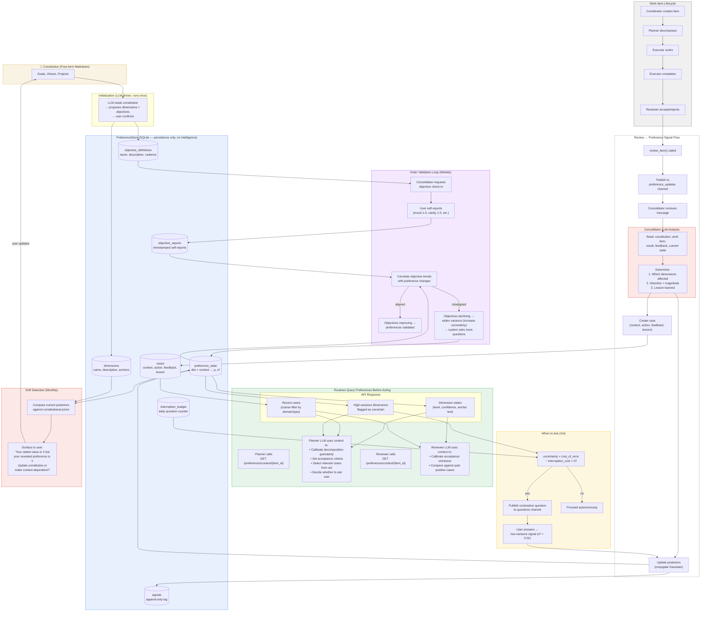
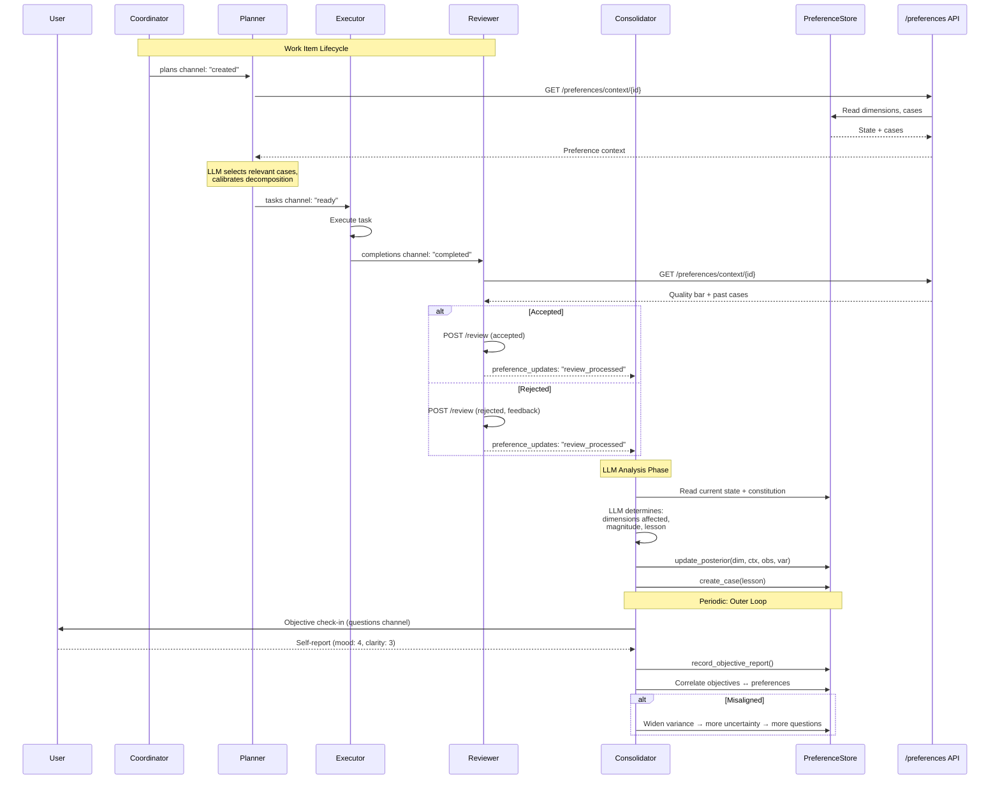
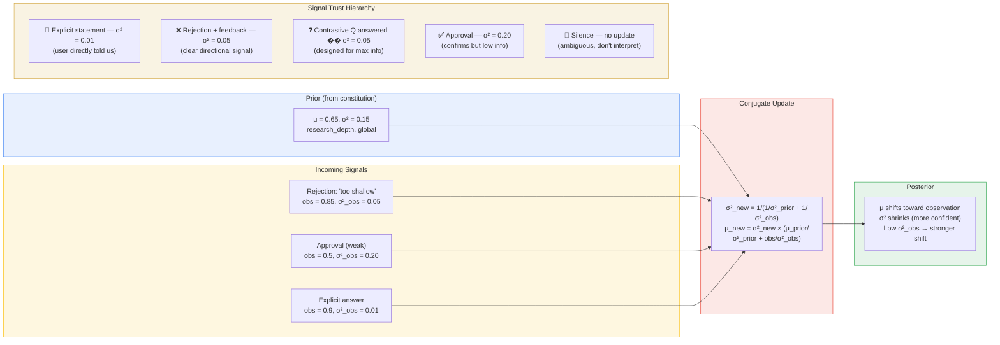
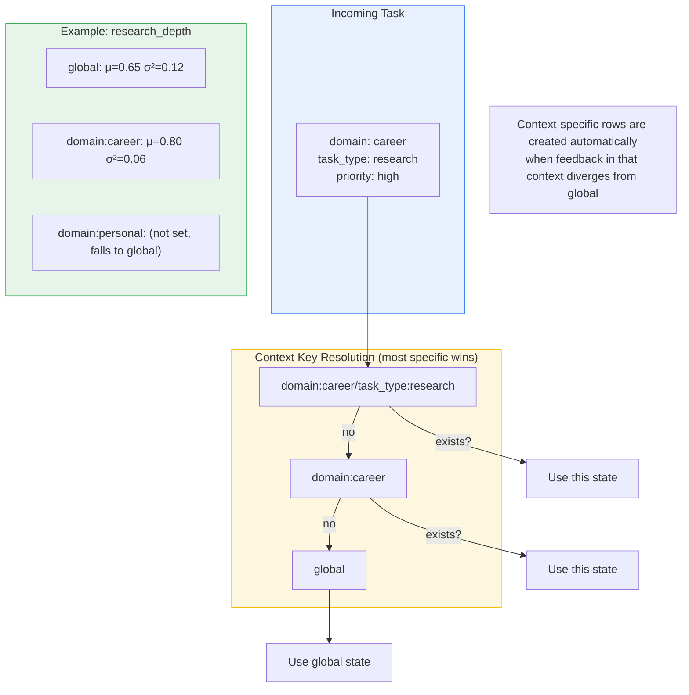

# Preference Learning Architecture

## System Overview

```mermaid
graph TB
    subgraph CONSTITUTION["📜 Constitution (Free-form Markdown)"]
        goals["Goals, Virtues, Projects"]
    end

    subgraph INIT["Initialization (LLM-driven, runs once)"]
        init_llm["LLM reads constitution<br/>→ proposes dimensions + objectives<br/>→ user confirms"]
    end

    goals --> init_llm
    init_llm --> dims_store
    init_llm --> obj_store

    subgraph STORE["PreferenceStore (SQLite — persistence only, no intelligence)"]
        dims_store[("dimensions<br/>name, description, anchors")]
        state_store[("preference_state<br/>dim × context → μ, σ²")]
        signal_store[("signals<br/>append-only log")]
        case_store[("cases<br/>context, action, feedback, lesson")]
        obj_store[("objective_definitions<br/>name, description, cadence")]
        obj_reports[("objective_reports<br/>timestamped self-reports")]
        budget_store[("interruption_budget<br/>daily question counter")]
    end

    subgraph WORK_ITEMS["Work Item Lifecycle"]
        create["Coordinator creates item"]
        decompose["Planner decomposes"]
        execute["Executor works"]
        complete["Executor completes"]
        review["Reviewer accepts/rejects"]
    end

    create --> decompose --> execute --> complete --> review

    subgraph REVIEW_FLOW["Review → Preference Signal Flow"]
        review_event["review_item() called"]
        publish_pref["Publish to<br/>preference_updates channel"]
        consol_receive["Consolidator receives message"]
        
        subgraph LLM_ANALYSIS["Consolidator LLM Analysis"]
            read_context["Read: constitution, work item,<br/>result, feedback, current state"]
            extract["Determine:<br/>1. Which dimensions affected<br/>2. Direction + magnitude<br/>3. Lesson learned"]
        end

        update_post["Update posteriors<br/>(conjugate Gaussian)"]
        create_case["Create case<br/>(context, action, feedback, lesson)"]
    end

    review --> review_event --> publish_pref --> consol_receive
    consol_receive --> read_context --> extract
    extract --> update_post --> state_store
    extract --> create_case --> case_store
    update_post --> signal_store

    subgraph ROUTINE_CONSUMPTION["Routines Query Preferences Before Acting"]
        planner_query["Planner calls<br/>GET /preferences/context/{item_id}"]
        
        subgraph CONTEXT_RESPONSE["API Response"]
            dim_summary["Dimension states<br/>(level, confidence, anchor text)"]
            recent_cases["Recent cases<br/>(coarse filter by domain/type)"]
            uncertainty["High-variance dimensions<br/>flagged as uncertain"]
        end

        planner_decides["Planner LLM uses context to:<br/>• Calibrate decomposition granularity<br/>• Set acceptance criteria<br/>• Select relevant cases from set<br/>• Decide whether to ask user"]

        reviewer_query["Reviewer calls<br/>GET /preferences/context/{item_id}"]
        reviewer_uses["Reviewer LLM uses context to:<br/>• Calibrate acceptance strictness<br/>• Compare against past positive cases"]
    end

    state_store --> dim_summary
    case_store --> recent_cases
    state_store --> uncertainty
    dim_summary --> planner_decides
    recent_cases --> planner_decides
    uncertainty --> planner_decides
    dim_summary --> reviewer_uses
    recent_cases --> reviewer_uses

    subgraph QUERY_POLICY["When to Ask (VoI)"]
        voi_calc["uncertainty × cost_of_error<br/>− interruption_cost > 0?"]
        ask_yes["Publish contrastive question<br/>to questions channel"]
        ask_no["Proceed autonomously"]
        user_answers["User answers →<br/>low-variance signal (σ² = 0.01)"]
    end

    uncertainty --> voi_calc
    budget_store --> voi_calc
    voi_calc -->|yes| ask_yes
    voi_calc -->|no| ask_no
    ask_yes --> user_answers --> update_post

    subgraph OUTER_LOOP["Outer Validation Loop (Weekly)"]
        checkin["Consolidator requests<br/>objective check-in"]
        user_reports["User self-reports<br/>(mood 1-5, clarity 1-5, etc.)"]
        correlate["Correlate objective trends<br/>with preference changes"]
        
        aligned["Objectives improving →<br/>preferences validated"]
        misaligned["Objectives declining →<br/>widen variance (increase uncertainty)<br/>→ system asks more questions"]
    end

    obj_store --> checkin
    checkin --> user_reports --> obj_reports
    obj_reports --> correlate
    state_store --> correlate
    correlate -->|aligned| aligned
    correlate -->|misaligned| misaligned
    misaligned --> state_store

    subgraph DRIFT["Drift Detection (Monthly)"]
        compare["Compare current posteriors<br/>against constitutional priors"]
        drift_report["Surface to user:<br/>'Your stated value is X but<br/>your revealed preference is Y.<br/>Update constitution or<br/>make context-dependent?'"]
    end

    state_store --> compare
    dims_store --> compare
    compare --> drift_report
    drift_report -->|user updates| goals

    style CONSTITUTION fill:#f9f3e3,stroke:#d4a843
    style STORE fill:#e8f0fe,stroke:#4285f4
    style LLM_ANALYSIS fill:#fce8e6,stroke:#ea4335
    style REVIEW_FLOW fill:#fff,stroke:#999
    style ROUTINE_CONSUMPTION fill:#e6f4ea,stroke:#34a853
    style QUERY_POLICY fill:#fef7e0,stroke:#fbbc04
    style OUTER_LOOP fill:#f3e8fd,stroke:#a142f4
    style DRIFT fill:#fce8e6,stroke:#ea4335
    style WORK_ITEMS fill:#f0f0f0,stroke:#666
```

## Data Flow Summary

```mermaid
sequenceDiagram
    participant U as User
    participant C as Coordinator
    participant P as Planner
    participant E as Executor
    participant R as Reviewer
    participant CS as Consolidator
    participant PS as PreferenceStore
    participant API as /preferences API

    Note over C,R: Work Item Lifecycle

    C->>+P: plans channel: "created"
    P->>API: GET /preferences/context/{id}
    API->>PS: Read dimensions, cases
    PS-->>API: State + cases
    API-->>P: Preference context
    
    Note over P: LLM selects relevant cases,<br/>calibrates decomposition
    
    P->>E: tasks channel: "ready"
    E->>E: Execute task
    E->>R: completions channel: "completed"
    
    R->>API: GET /preferences/context/{id}
    API-->>R: Quality bar + past cases
    
    alt Accepted
        R->>R: POST /review (accepted)
        R-->>CS: preference_updates: "review_processed"
    else Rejected
        R->>R: POST /review (rejected, feedback)
        R-->>CS: preference_updates: "review_processed"
    end

    Note over CS: LLM Analysis Phase

    CS->>PS: Read current state + constitution
    CS->>CS: LLM determines:<br/>dimensions affected,<br/>magnitude, lesson
    CS->>PS: update_posterior(dim, ctx, obs, var)
    CS->>PS: create_case(lesson)

    Note over CS,PS: Periodic: Outer Loop

    CS->>U: Objective check-in (questions channel)
    U-->>CS: Self-report (mood: 4, clarity: 3)
    CS->>PS: record_objective_report()
    CS->>PS: Correlate objectives ↔ preferences
    
    alt Misaligned
        CS->>PS: Widen variance → more uncertainty → more questions
    end
```

## Bayesian Update Mechanics

```mermaid
graph LR
    subgraph PRIOR["Prior (from constitution)"]
        p["μ = 0.65, σ² = 0.15<br/>research_depth, global"]
    end

    subgraph SIGNALS["Incoming Signals"]
        s1["Rejection: 'too shallow'<br/>obs = 0.85, σ²_obs = 0.05"]
        s2["Approval (weak)<br/>obs = 0.5, σ²_obs = 0.20"]
        s3["Explicit answer<br/>obs = 0.9, σ²_obs = 0.01"]
    end

    subgraph UPDATE["Conjugate Update"]
        formula["σ²_new = 1/(1/σ²_prior + 1/σ²_obs)<br/>μ_new = σ²_new × (μ_prior/σ²_prior + obs/σ²_obs)"]
    end

    subgraph POSTERIOR["Posterior"]
        post["μ shifts toward observation<br/>σ² shrinks (more confident)<br/>Low σ²_obs → stronger shift"]
    end

    p --> formula
    s1 --> formula
    s2 --> formula
    s3 --> formula
    formula --> post

    subgraph SIGNAL_TRUST["Signal Trust Hierarchy"]
        direction TB
        t1["🎯 Explicit statement — σ² = 0.01<br/>(user directly told us)"]
        t2["❌ Rejection + feedback — σ² = 0.05<br/>(clear directional signal)"]
        t3["❓ Contrastive Q answered �� σ² = 0.05<br/>(designed for max info)"]
        t4["✅ Approval — σ² = 0.20<br/>(confirms but low info)"]
        t5["🤷 Silence — no update<br/>(ambiguous, don't interpret)"]
    end

    style PRIOR fill:#e8f0fe,stroke:#4285f4
    style SIGNALS fill:#fef7e0,stroke:#fbbc04
    style UPDATE fill:#fce8e6,stroke:#ea4335
    style POSTERIOR fill:#e6f4ea,stroke:#34a853
    style SIGNAL_TRUST fill:#f9f3e3,stroke:#d4a843
```

## Context Resolution Hierarchy

```mermaid
graph TB
    subgraph TASK["Incoming Task"]
        t["domain: career<br/>task_type: research<br/>priority: high"]
    end

    subgraph RESOLUTION["Context Key Resolution (most specific wins)"]
        l3["domain:career/task_type:research"]
        l2["domain:career"]
        l1["global"]
    end

    t --> l3
    l3 -->|exists?| found3["Use this state"]
    l3 -->|no| l2
    l2 -->|exists?| found2["Use this state"]
    l2 -->|no| l1
    l1 --> found1["Use global state"]

    subgraph EXAMPLE["Example: research_depth"]
        g["global: μ=0.65 σ²=0.12"]
        c["domain:career: μ=0.80 σ²=0.06"]
        p["domain:personal: (not set, falls to global)"]
    end

    Note["Context-specific rows are created automatically<br/>when feedback in that context diverges from global"]

    style TASK fill:#e8f0fe,stroke:#4285f4
    style RESOLUTION fill:#fef7e0,stroke:#fbbc04
    style EXAMPLE fill:#e6f4ea,stroke:#34a853
```
